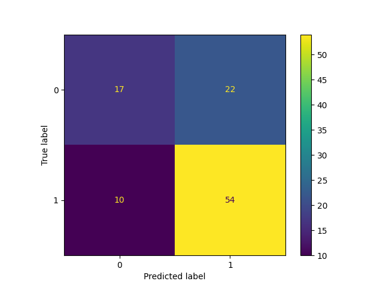
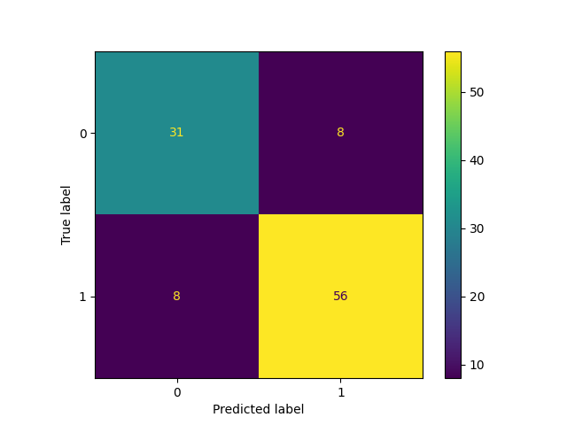
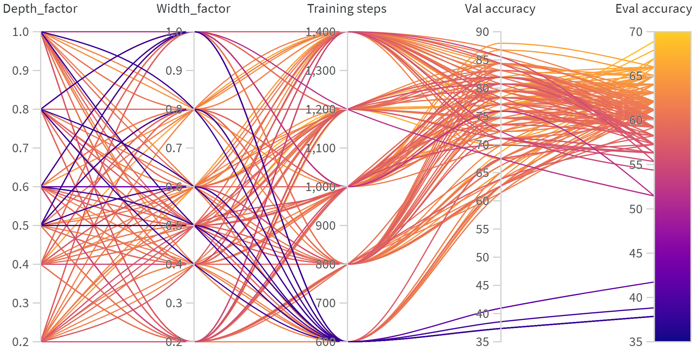
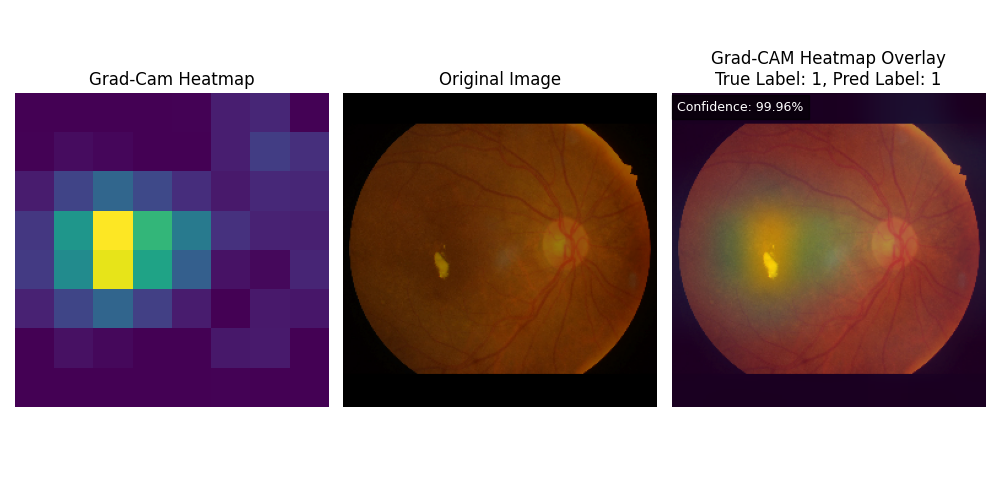

# Diabetic Retinopathy Detection

Binary classification of retinal fundus images into *non-referable* and *referable*
diabetic retinopathy, using two approaches: an EfficientNetV2 built from scratch and
transfer learning with an ImageNet-pretrained EfficientNetV2-B1. Grad-CAM is used to
show which image regions drive the prediction.

This was a semester project in a university deep learning lab course (winter term
2024/25), carried out in a team of two. The results were written up as a scientific
paper, which is not part of this repository.

## Overview

- **Data:** [IDRiD](https://ieee-dataport.org/open-access/indian-diabetic-retinopathy-image-dataset-idrid)
  (Indian Diabetic Retinopathy Image Dataset), 413 training and 103 test images.
  The five retinopathy grades are mapped to two classes: grades 0 and 1 become class 0
  (non-referable), grades 2 to 4 become class 1 (referable).
- **Input pipeline:** `tf.data` pipeline that crops the fundus area, resizes with padding
  to 256 x 256, normalizes, and augments the training set with random flips.
  20 % of the training images are held out for validation.
- **Models:**
  - *EfficientNetV2 from scratch:* own implementation of MBConv and Fused-MBConv blocks
    with optional squeeze-and-excitation, scalable through a width and a depth factor.
  - *Transfer learning:* pretrained EfficientNetV2 (S, B0 or B1) with a new classification
    head and a configurable number of unfrozen layers.
- **Training:** custom training loop with Adam and sparse categorical cross-entropy,
  checkpointing, and logging of accuracy, precision, recall and F1 score.
- **Experiment tracking:** [Weights & Biases](https://wandb.ai), including a grid sweep
  over the scaling factors and the number of training steps.
- **Configuration:** all parameters are set in one file with [Gin](https://github.com/google/gin-config).

## Results

Evaluated on the 103 IDRiD test images.

| Model | Test accuracy | F1 score | Depth factor | Width factor |
|---|---|---|---|---|
| EfficientNetV2-B0 from scratch (baseline) | 65.0 % | 0.77 | 1.0 | 1.0 |
| EfficientNetV2-B0 from scratch (scaled down 1) | 68.9 % | 0.77 | 1.0 | 0.5 |
| EfficientNetV2-B0 from scratch (scaled down 2) | 67.9 % | 0.78 | 0.8 | 0.6 |
| **EfficientNetV2-B1, transfer learning** | **84.5 %** | **0.87** | 1.1 | 1.0 |

Scaling the network down barely changes the result of the models trained from scratch.
Transfer learning raises the test accuracy by about 16 percentage points.

EfficientNetV2 from scratch (scaled down 1) | Transfer learning
:-------------------------:|:-------------------------:
 | 
Sensitivity 84.4 %, specificity 43.6 % | Sensitivity 87.5 %, specificity 79.5 %

With only 413 training images, the model trained from scratch mostly learns to predict
the majority class and misses more than half of the healthy cases. The pretrained
model keeps the general image features learned on ImageNet, only its upper layers are
fine-tuned, and it separates both classes considerably better.

### Hyperparameter sweep

Grid search over depth factor, width factor and number of training steps for the
EfficientNetV2 trained from scratch. Each line is one run, colored by test accuracy.



### Grad-CAM

Grad-CAM heatmap of the transfer learning model for a correctly classified test image.
The model focuses on the lesion in the center of the retina.



## Project structure

```
diabetic_retinopathy/
├── configs/config.gin              all parameters
├── input_pipeline/
│   ├── datasets.py                 loading, label mapping, tf.data pipeline
│   └── preprocessing.py            cropping, resizing, normalization, augmentation
├── models/
│   ├── layers.py                   SE, MBConv and Fused-MBConv blocks
│   └── architectures.py            EfficientNetV2 and transfer learning model
├── evaluation/
│   ├── metrics.py                  accuracy, precision, recall, F1
│   ├── eval.py                     evaluation on the test set, confusion matrix
│   └── deep_visualization.py       Grad-CAM
├── utils/                          run folders, logging, W&B setup
├── train.py                        training loop
├── main.py                         entry point for training and evaluation
└── wandb_sweep.py                  hyperparameter sweep
```

## Setup

The project was developed with Python 3.9 and TensorFlow 2.10.

```
pip install -r requirements.txt
```

Download the IDRiD *Disease Grading* data and arrange it like this:

```
<data_dir>/IDRID_dataset/
├── images/train/     IDRiD_001.jpg ...
├── images/test/
└── labels/
    ├── train.csv
    └── test.csv
```

Then set `load.data_dir` in `configs/config.gin` to your `<data_dir>`.

## Usage

```
python main.py                                    # train, then evaluate
python main.py --run <path-to-run-folder>         # continue training from a checkpoint
python main.py --notrain --run <path-to-run-folder>   # evaluate only
python wandb_sweep.py                             # hyperparameter sweep (needs a W&B account)
```

Each run writes its checkpoints, logs and a copy of the configuration to a folder
`experiments/run_<timestamp>`, located next to the project folder.

### Weights & Biases

By default, runs are logged offline. To synchronise them, set your own values in
`configs/config.gin`:

```
wandb_init.project = "your-project"
wandb_init.entity = "your-entity"
wandb_init.key = "xxx"
```

Do not commit your API key. Passing it on the command line with `--wandb <your-api-key>`
keeps it out of the repository.

### Switching between the two models

The default configuration trains the transfer learning model used for the results
(EfficientNetV2-B1, 320 unfrozen layers). To train the EfficientNetV2 from scratch
instead, change these parameters in `configs/config.gin`:

```
choose_model_to_train.model_name = 'efficientnet_v2'
Trainer.total_steps = 1200
prepare.batch_size = 16
preprocess.mode_norm = True
overlay_and_display_heatmap.mode_norm = True
```

`preprocess.mode_norm` and `overlay_and_display_heatmap.mode_norm` must always have the
same value. `True` scales images to [0, 1], `False` to [-1, 1] as expected by the
pretrained model.

## Data

The data set is not part of this repository. IDRiD is published under a
[CC BY 4.0](https://creativecommons.org/licenses/by/4.0/) license:

> P. Porwal et al., "Indian Diabetic Retinopathy Image Dataset (IDRiD): A Database for
> Diabetic Retinopathy Screening Research", *Data*, vol. 3, no. 3, 2018.

The fundus image in the Grad-CAM figure is taken from this data set.
